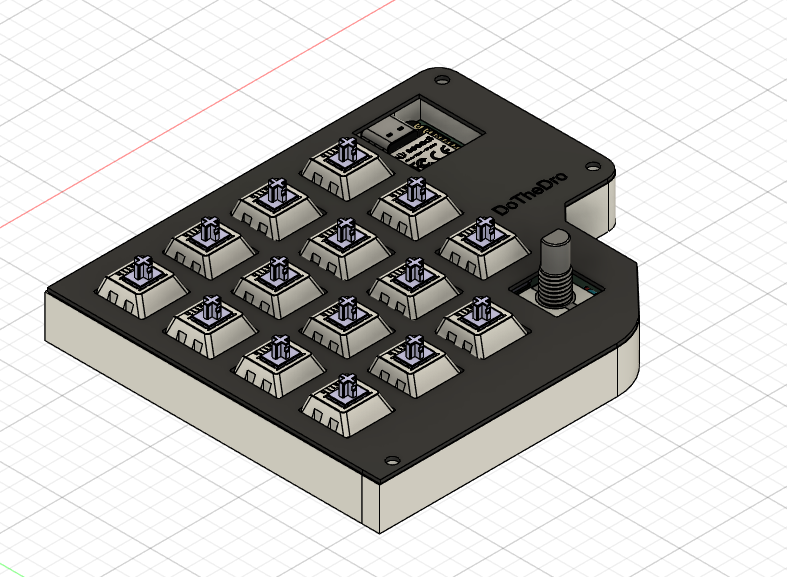
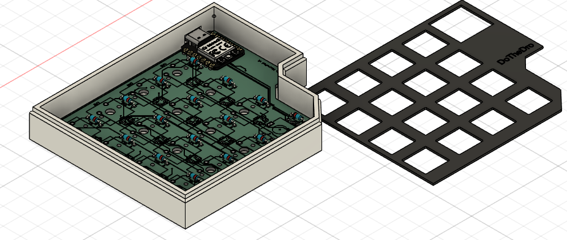

# Steampad ⌨️

**Steampad** is a high-performance 4x4 macropad featuring a rotary encoder and full per-key RGB lighting. Powered by the **Seeed Studio XIAO RP2040**, it is designed for maximum productivity and customization using **QMK Firmware** and the **VIAL** protocol.

---

## Features
* **16 Mechanical Keys:** A full 4x4 grid for macros, shortcuts, and numpad use.
* **Rotary Encoder:** EC11 encoder for precision volume control, scrolling, or scrubbing.
* **Per-Key RGB:** 16 integrated SK6812 Mini-E LEDs for vibrant, customizable lighting.
* **VIAL Support:** Change your keymap and macros in real-time via the VIAL web or desktop app—no code editing required after flashing.
* **RP2040 Power:** Utilizes the RP2040's PIO state machines for perfect LED timing and ultra-low latency.

---

## Hardware Overview
The Steampad uses a matrix circuit with a **COL2ROW** diode orientation, ensuring that every keypress is registered independently (NKRO). Designed in KiCad.

### PCB & Pinout
* **Controller:** Seeed Studio XIAO RP2040
* **Rows:** GP0, GP1, GP2, GP3
* **Columns:** GP4, GP7, GP27, GP26
* **RGB Data:** GP6 (D5)
* **Encoder:** GP29 (Phase A), GP28 (Phase B)

---

### Enclosure
The Steampad's enclosure does not any have screws. It will be secured by notches under the cover and glued for a cleaner (in my opinion) look.

---

## Firmware Overview
The firmware is built on **QMK** with VIAL features enabled. 

### Default Keymap:
* **Row 0:** Chrome, Discord, File Explorer, Next Track
* **Row 1:** Ctrl+Alt+Del, Copy, Paste, Previous Track
* **Row 2:** Lock Computer, Snipping Tool, Game Bar, Windows+Tab
* **Row 3:** Undo (Ctrl+Z), Win+E, Win+D, Play/Pause (Encoder Click)
* **Encoder Rotation:** Volume Up / Volume Down

### VIAL Customization:
1. Flash the `.uf2` file.
2. Visit [vial.rocks](https://vial.rocks).
3. Connect your Steampad to remap keys and create macros instantly.

---

## BOM (Bill of Materials)
* **1x** Seeed XIAO RP2040
* **1x** EC11 Rotary Encoder
* **16x** MX-style Mechanical Switches
* **16x** 1N4148 Diodes
* **16x** SK6812 Mini-E (or WS2812B) LEDs
* **16x** Keycaps
* **1x** Steampad Case & Plate

---

### Others:
Hi, I made this for 2 days and this is my first time ever coding, making PCBs, and making cases in fusion. I have very little experience with softwares like Fusion and KiCad.
I made this MacroPad to make my life easier and also to gain experiences for my future career.
